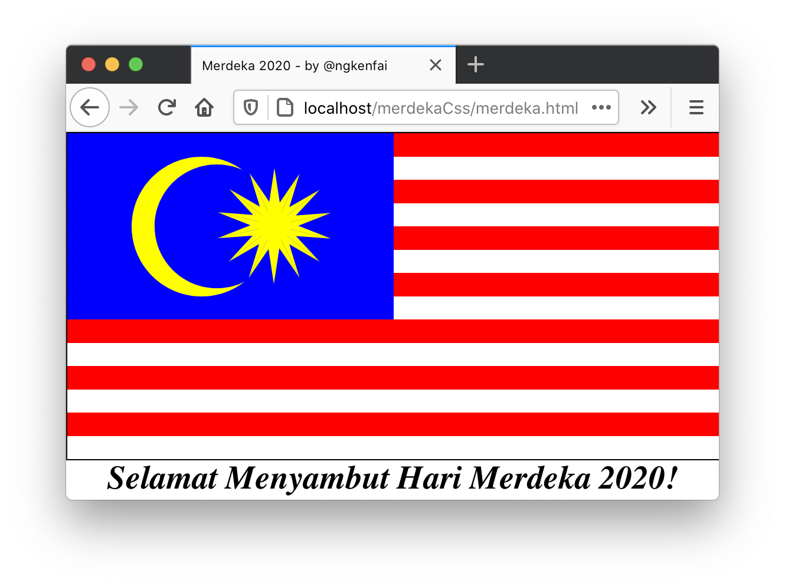

# MERDEKA CSS

In conjunction with the independence day of Malaysia (31st August 1957), also known as **_Hari Merdeka_**, this Flag of Malaysia is generated entirely with CSS only.

### On Firefox:

### Features
- CSS Only!
- Uses borders and `:before` `:after` properties for shapes generation
- Uses percentage and `calc()` extensively to maintain size flexibility

### References:
- https://en.wikipedia.org/wiki/Flag_of_Malaysia#Construction_sheet
- https://css-tricks.com/the-shapes-of-css/